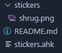

# Stickers for Discord!

[This has already been done with a bot](https://github.com/DarylPinto/stickers-for-discord), but it's kinda unwieldy to add new stickers and the stickers aren't actually posted in your own messages and such.

This, on the other hand, is an AutoHotKey script for sending stickers. It works like this:
1. You set the path of [NirCmd](https://www.nirsoft.net/utils/nircmd.html)'s `nircmd.exe`.
2. You set the path of [ImageMagick](https://imagemagick.org/index.php)'s `magick.exe`.
3. You configure other options such as the directory you'll be keeping your stickers, the prefix you need to type for the sticker, and the max height of your sticker.
4. Add stickers to your sticker directory. For instance, if I keep the sticker directory as `<the same directory this script is in>\stickers\`, my folder layout would look kinda like this: 

5. If using the rest of the config as default, typing `!shrug` in Discord would:
	- If it didn't exist already, create a `.sticker_cache` directory.
	- If there wasn't already a cached version of the sticker, it would resize the sticker and save it as `.sticker_cache\shrug.png`
	- The resized sticker would be copied into the clipboard with NirCmd, and pasted with `Ctrl+v`. 

Notes: Works with transparency! But only because it uses NirCmd. I swear, like *nothing else ever* supports transparency with clipboards, it was only by someone else saving me that I was able to get that to work. [So thank them, they're a magical girl hero](https://github.com/Karob2/).
